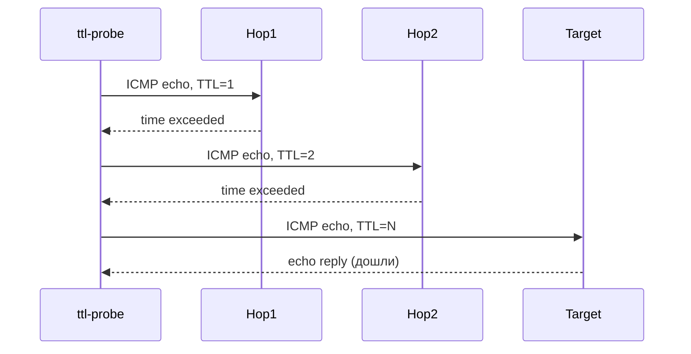

# ttl-probe

свой traceroute на C++ через сырые ICMP-сокеты. шлёт echo-запросы с растущим TTL и смотрит кто отвечает "time exceeded" на каждом хопе.



изначально планировал сюда честный fake-packet TTL-трюк (как в zapret), но на винде это требует сырых TCP-пакетов, а винда с висты их резать не даёт без отдельного драйвера (WinDivert/Npcap) — это уже не "просто". traceroute зато честно показывает сколько хопов до сервера, полезно прежде чем городить любой TTL-трюк вручную.

## сборка

```
cmake -B build
cmake --build build --config Release
```

## юзать

нужны права администратора (сырые сокеты):

```
build\Release\ttlprobe.exe example.com 30
```
